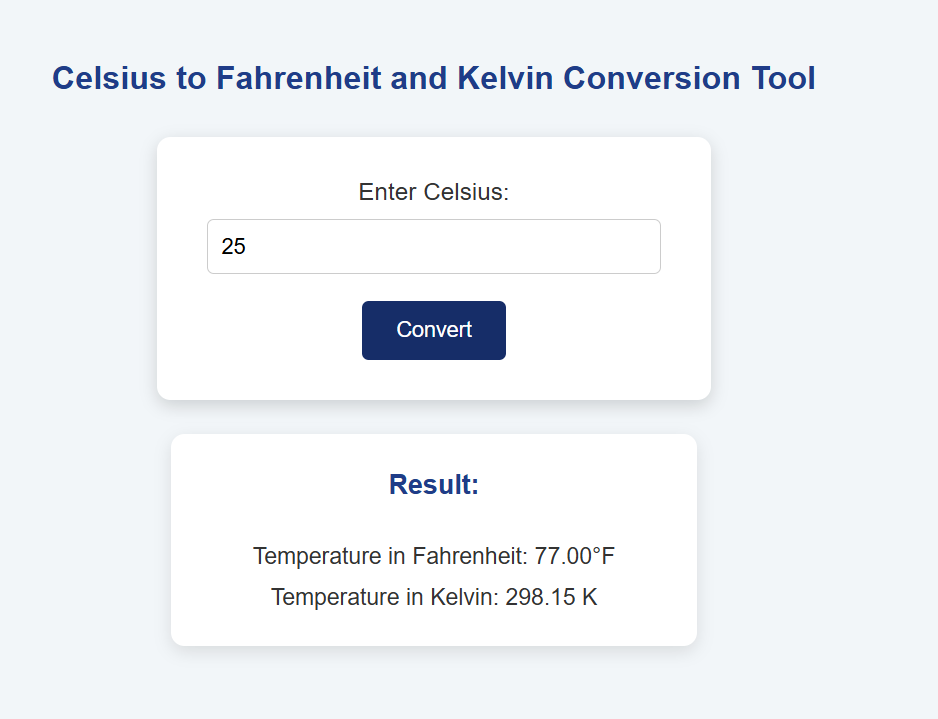

#  Temperature Converter

A simple and responsive temperature conversion web application built with **HTML, CSS, and JavaScript**.

The application allows users to enter a temperature in **Celsius** and convert it to **Fahrenheit** and **Kelvin**.

##  Features

- Convert Celsius to Fahrenheit
- Convert Celsius to Kelvin
- Validate temperatures below absolute zero
- Display results with two decimal places
- Simple and clean user interface
- Responsive design
- Beginner-friendly JavaScript project

## Technologies
## 🛠️ Technologies


## Project Structure

```text
temperature-converter/
│
├── index.html
├── style.css
├── script.js
└── README.md
```
## How to Run

1. Clone the repository.
  ```bash
git clone https://github.com/ashahsana-sketch/temperature-converter.git
```

2. Open the project folder.
   1. Find `index.html`.
   2. Find `style.css`.
   3. Find `script.js`.
```bash
cd temperature-converter
```
3. Open `index.html` in your browser.
   No additional dependencies or installation are required.

### Conversion Formulas
Celsius to Fahrenheit
```bash
°F = (°C × 9/5) + 32
```
Celsius to Kelvin 
```bash
K = °C + 273.15
```
If a temperature below -273.15°C is entered, an error message is displayed.
Example
```bash
Input:25
```
Output
```bash
Fahrenheit: 77.00°F
Kelvin: 298.15 K
```
4. Enter a temperature in Celsius.
 ```bash
    25
```
5. Click the **Convert** button.
```bash
Convert
```
Screenshot


## Future Improvements

- [ ] Add Fahrenheit to Celsius conversion
- [ ] Add Kelvin to Celsius conversion
- [ ] Add Fahrenheit to Kelvin conversion
- [ ] Add a unit-selection dropdown
- [ ] Add dark mode
- [ ] Add conversion history
- [ ] Improve mobile responsiveness

## Author

**Sana**

GitHub: [@ashahsana-sketch](https://github.com/ashahsana-sketch)

